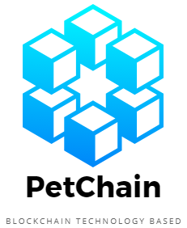

 

# PetChain
```
Sistema para la gestión de mascotas diseñado para el Trabajo de Fin de Grado de Escuela Superior de Ing. y Tecnología de la UNIR
```

```

### Customize configuration
See [Configuration Reference](https://cli.vuejs.org/config/).
